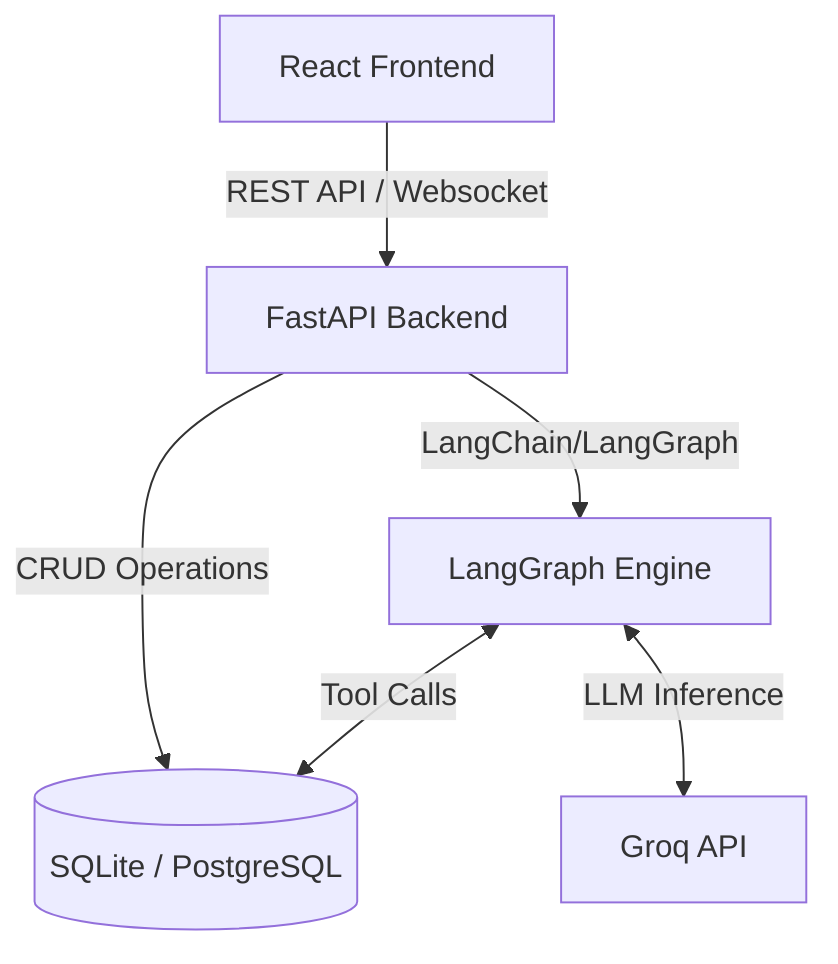

<div align="center">
  
  <h1>MedConnect AI</h1>
  <p><strong>Intelligent CRM for Pharmaceutical Field Sales Professionals</strong></p>
  
  <p>
    <a href="#features">Features</a> •
    <a href="#architecture">Architecture</a> •
    <a href="#installation">Installation</a> •
    <a href="#api-documentation">API</a> •
    <a href="#langgraph-workflow">LangGraph Workflow</a>
  </p>
</div>

---

## 📖 Project Overview

**MedConnect AI** is an enterprise-grade Customer Relationship Management (CRM) platform specifically designed for pharmaceutical sales representatives. It combines traditional CRM workflows (tracking interactions, scheduling follow-ups, viewing doctor profiles) with advanced Generative AI capabilities powered by **LangGraph** and **Groq (gemma2-9b-it)**.

Sales reps can manage their territory using the modern, responsive React dashboard or by simply chatting with the integrated AI assistant, which can automatically log visits, schedule tasks, extract critical entities (products, sentiments), and generate strategic engagement recommendations.

## ✨ Features

- **Omnichannel AI Assistant**: Log interactions, schedule follow-ups, and query past data through natural conversation.
- **Smart Data Extraction**: Automatically extracts HCP names, pharmaceutical products, dates, and sentiment from raw rep notes.
- **Next Best Action (NBA)**: AI-generated strategic recommendations for future doctor engagements.
- **Interaction Timeline**: Rich, chronological view of past interactions with automated summaries.
- **Dashboard Analytics**: Real-time metrics on territory coverage, interaction types, and sentiment distribution.
- **Responsive Enterprise UI**: Modern, glass-morphic design built with vanilla CSS variables and Inter typography.

## 🏗️ Architecture

MedConnect AI follows a decoupled Client-Server architecture with a state-machine driven AI engine.



## 📂 Folder Structure

```text
avion-assignment/
├── backend/
│   ├── app/
│   │   ├── api/           # FastAPI routers (v1)
│   │   ├── core/          # App config and security
│   │   ├── graphs/        # LangGraph nodes, edges, state
│   │   ├── models/        # SQLAlchemy ORM models
│   │   ├── prompts/       # LLM prompt templates (System, Extraction, etc.)
│   │   ├── schemas/       # Pydantic validation schemas
│   │   ├── services/      # Business logic (CRUD)
│   │   └── tools/         # LangChain tools for the agent
│   ├── alembic/           # Database migrations
│   └── main.py            # FastAPI entry point
└── frontend/
    ├── src/
    │   ├── components/    # Reusable UI components (Sidebar, Navbar, Modals)
    │   ├── context/       # React Context (Toast)
    │   ├── pages/         # Route components (Dashboard, DoctorList, LogInteraction)
    │   ├── store/         # Redux state management
    │   └── index.css      # Global design system variables
    └── package.json
```

## 🛠️ Technology Stack

**Frontend:**
- React 18 (Vite)
- Redux Toolkit
- React Router DOM
- Vanilla CSS (Custom Design System)
- Lucide React (Icons)

**Backend:**
- Python 3.10+
- FastAPI (Async Web Framework)
- SQLAlchemy 2.0 (Async ORM)
- Alembic (Migrations)
- LangChain & LangGraph (AI Agent Framework)

**AI & Infrastructure:**
- Groq (gemma2-9b-it)
- SQLite (Development) / PostgreSQL (Production)

## 🚀 Installation

### Prerequisites
- Python 3.10 or higher
- Node.js 18 or higher
- Groq API Key

### 1. Clone the repository
```bash
git clone https://github.com/your-org/medconnect-ai.git
cd medconnect-ai
```

### 2. Environment Variables
Navigate to the backend directory and set up your `.env` file:
```bash
cd backend
cp .env.example .env
```
Edit `.env` and insert your `GROQ_API_KEY`. (See [Environment Variables](#environment-variables) below for details).

### 3. Database Setup (Backend)
```bash
# Create virtual environment
python -m venv venv
source venv/bin/activate  # On Windows: venv\Scripts\activate

# Install dependencies
pip install -r requirements.txt

# Run database migrations
alembic upgrade head

# (Optional) Seed the database with mock doctors and interactions
python seed.py
```

### 4. Running Backend
Start the FastAPI server:
```bash
uvicorn app.main:app --reload --port 8000
```
The backend will be available at `http://localhost:8000`.

### 5. Running Frontend
Open a new terminal window:
```bash
cd frontend

# Install dependencies
npm install

# Start development server
npm run dev
```
The frontend will be available at `http://localhost:5173`.

## ⚙️ Environment Variables

The backend requires a `.env` file to run. See `backend/.env.example` for the full list of options.

| Variable | Description | Default |
|----------|-------------|---------|
| `APP_ENV` | Environment (development/production) | `development` |
| `DATABASE_URL` | SQLAlchemy connection string | `sqlite+aiosqlite:///./crm.db` |
| `GROQ_API_KEY` | Your API key from console.groq.com | *Required* |
| `SECRET_KEY` | JWT signing key | *Required* |
| `CORS_ORIGINS` | Allowed frontend domains | `http://localhost:5173` |

## 📚 API Documentation

Once the backend is running, FastAPI auto-generates interactive API documentation:
- **Swagger UI**: `http://localhost:8000/docs`
- **ReDoc**: `http://localhost:8000/redoc`

Key endpoints include:
- `GET /api/v1/doctors` - Retrieve territory HCPs.
- `GET /api/v1/interactions` - Retrieve paginated interaction history.
- `POST /api/v1/chat` - Send a message to the LangGraph AI agent.

## 🧠 LangGraph Workflow

MedConnect AI uses a cyclical graph architecture managed by LangGraph. 

1. **Reasoning Node**: The LLM (gemma2-9b-it) evaluates the user's input alongside the system prompt (`MEDCONNECT_SYSTEM_PROMPT`).
2. **Conditional Edge**: The graph decides whether to execute a tool or proceed to formatting.
3. **Tool Execution Node**: Safely executes CRUD operations against the database.
4. **Response Formatter Node**: Coerces the final output into a strict JSON schema for the frontend to consume safely.

## 🧰 AI Tools Explanation

The AI agent has access to the following tools (`backend/app/tools/crm_tools.py`):

- `log_interaction`: Extracts fields from natural language to create a new CRM record.
- `edit_interaction`: Updates specific fields of past interactions.
- `search_interactions`: Queries the database by date, doctor, or keyword.
- `schedule_follow_up`: Creates pending tasks and reminders.
- `ai_recommendation`: Analyzes past interactions to suggest the "Next Best Action".

## 📸 Screenshots

> *Placeholder: Add screenshots of Dashboard, Chat Interface, and Doctor Profile here.*
> 
> ``
> ``

## 🧪 Testing Instructions

Run the backend test suite (requires `pytest`):
```bash
cd backend
pytest tests/
```

Run frontend tests (requires `vitest`):
```bash
cd frontend
npm test
```

## 🚢 Deployment Guide

**Backend (Docker):**
A `Dockerfile` is provided for containerization.
```bash
docker build -t medconnect-backend ./backend
docker run -p 8000:8000 --env-file ./backend/.env medconnect-backend
```

**Frontend (Vercel/Netlify):**
```bash
cd frontend
npm run build
```
Upload the `dist/` folder to your static hosting provider.

## 🔮 Future Improvements

- **Multi-tenant Authentication**: Full JWT-based auth flows for different sales teams.
- **Voice-to-Text**: Native browser audio capture for hands-free interaction logging.
- **Offline Mode**: PWA support with local caching for rural territories with poor cell service.
- **RAG for Medical Literature**: Allow the agent to query approved medical PDFs to answer doctor questions on the spot.

## 📄 License

This project is licensed under the MIT License - see the [LICENSE](LICENSE) file for details.
